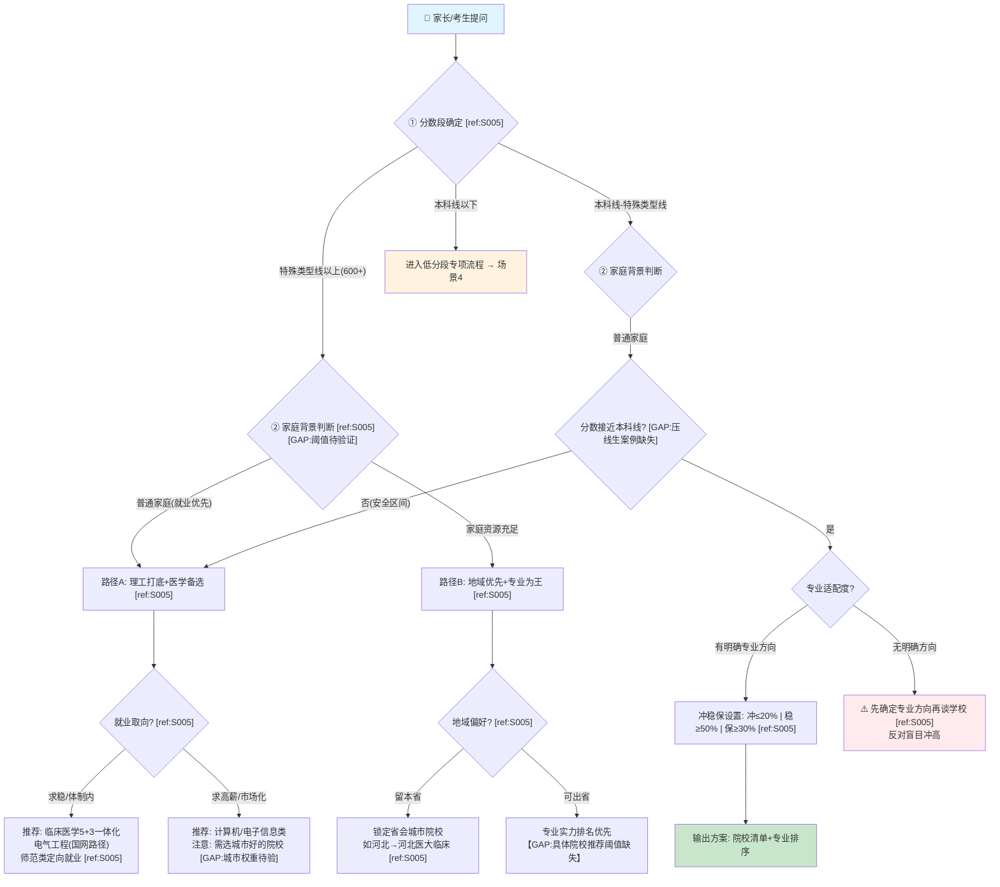
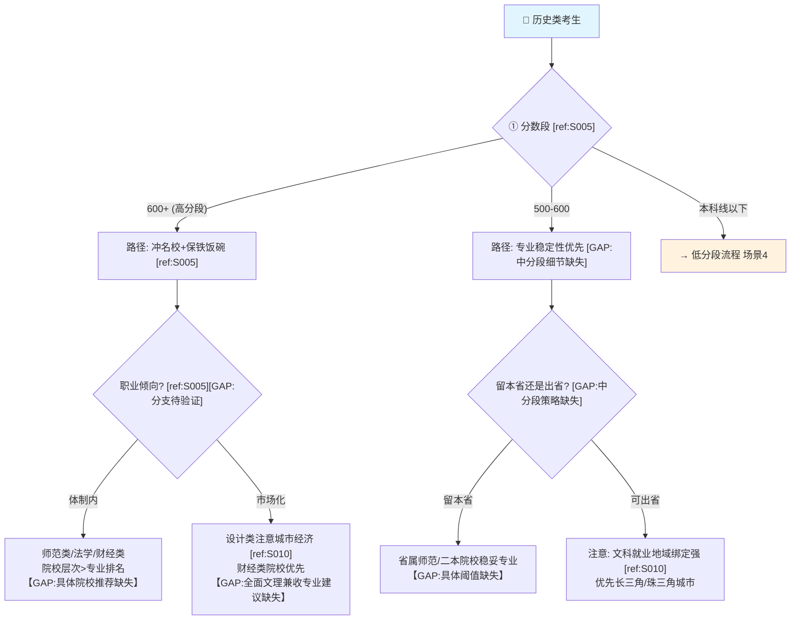
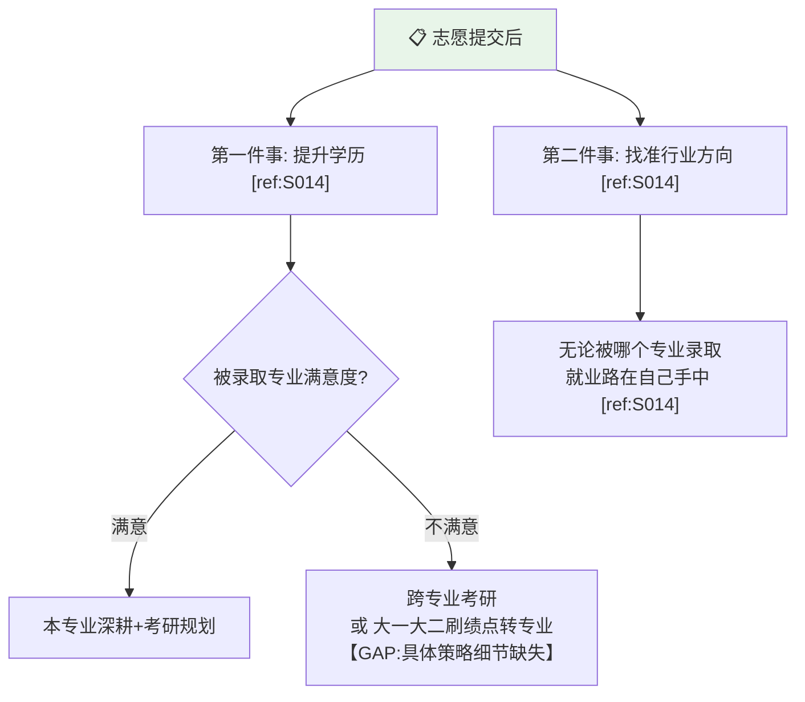
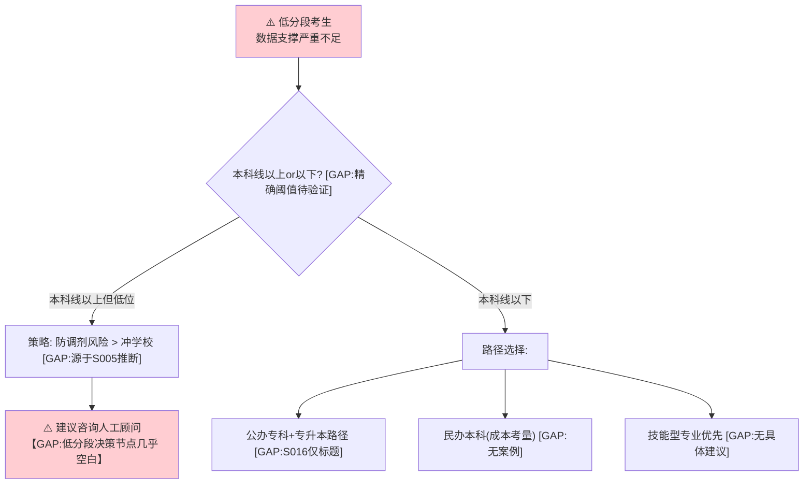
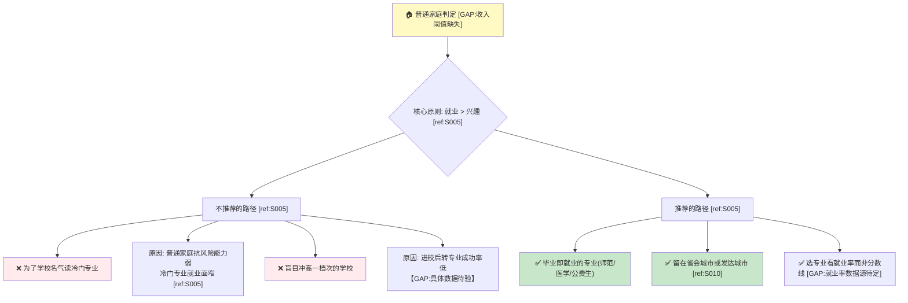
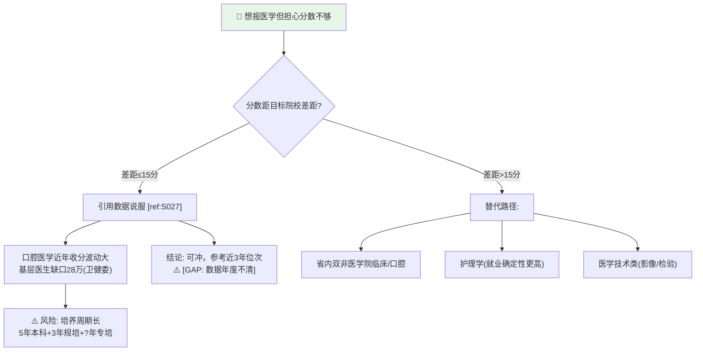
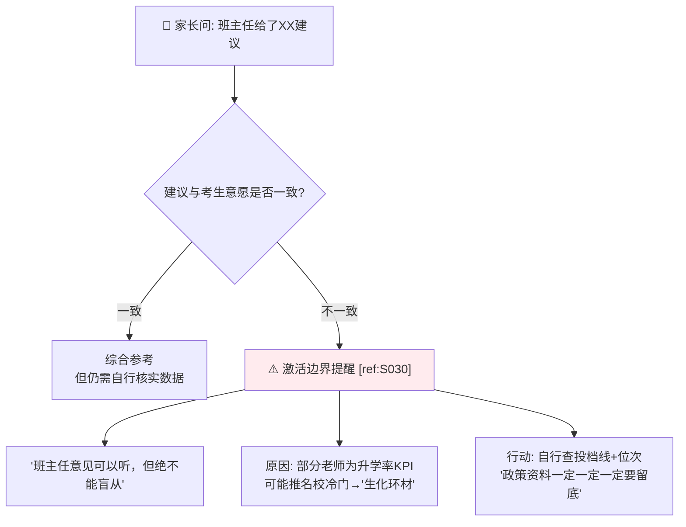

# 武亮视角 · 决策树
# 符合 nuwa-skill decision_tree 规范
# 每个节点标注素材溯源 [ref:Sxxx]
# 所有 Mermaid 节点可直接在 Markdown 渲染器中查看

---

## 场景1: 物理类考生志愿规划 (主决策流)

**溯源检查:**
- Q1→Q2 逻辑: [ref:S005] "物理类600分：理工打底、医学备选、地域优先、专业为王"
- PATH_A: [ref:S005] "就业优先、兼顾升学"
- A2 具体推荐: [ref:S005] "临床医学5+3一体化"
- Q7: [ref:S005] "坚决反对'为了学校读天坑专业'"
- **已知 GAP**: 分数段精确阈值、压线生具体策略、城市权重计算

---

## 场景2: 历史类考生志愿规划

**溯源检查:**
- HPATH_A: [ref:S005] "历史类600分：冲名校、保铁饭碗"
- HA3 地域提醒: [ref:S010] "强调城市经济对设计类就业的影响"
- **已知 GAP**: 历史类中分段策略、协议内"铁饭碗"具体专业清单、文理兼收专业处理方式

---

## 场景3: 志愿填报后规划线

**溯源检查:**
- POST1/POST2 结构: [ref:S014] "志愿填报之后的人生规划：第一件事全力以赴提升学历，第二件事找准行业方向"
- P2A: [ref:S014] 原话 "无论孩子最终被哪个专业录取，未来的就业之路，其实都掌握在自己手中"

---

## 场景4: 低分段专项 (400分及以下) [⚠️ 大量GAP]

**⚠️ 严重警告**: 低分段策略几乎全部标注 [GAP]，仅凭 [ref:S016] 视频标题推断。此模块在获得≥3个低分段完整案例前**不建议启用**。

---

## 场景5: 普通家庭专项策略

**溯源检查:**
- FAM1: [ref:S005] 整体基调为就业优先
- FAM2A: [ref:S005] "坚决反对'为了学校读天坑专业'"
- FAM2B: [ref:S005] "不浪费一分分数、不盲目冲高"
- FAM3B: [ref:S010] 视频案例中强调城市对就业的影响

---

## 决策树节点参数表

| 节点变量 | 数据类型 | 当前确定值 | 不确定范围 | 溯源 |
|----------|----------|-----------|-----------|------|
| 物理类高分段阈值 | 整数(分) | ≥600(河北参考) | 各省特殊类型线不同 | [ref:S005] |
| 普通家庭收入阈值 | 区间(万元/年) | [GAP] | [GAP] | 无来源 |
| 冲稳保比例 | 百分比 | 冲≤20%, 稳≥50%, 保≥30% | 具体浮动范围待验 | [ref:S005] |
| 城市权重系数 | 归一化权重 | [GAP] | [GAP] | [ref:S010]仅定性 |
| 天坑专业列表 | 集合(专业名称) | 生化环材 [ref:S030] | 完整列表待验 | [ref:S005][ref:S030] |
| 铁饭碗专业清单 | 集合(专业名称) | 师范/法学/财经/临床口腔 [ref:S027] | 未穷举 | [ref:S005][ref:S027] |
| 医学分波动幅度 | 百分比 | "暴跌30%" [ref:S027] | 具体年度省份不清 | [ref:S027] |
| 🔧 班主任意见可信度 | 定性 | "可以听但绝不能盲从" [ref:S030] | 无量化 | [ref:S030] |

---

## ⚠️ Known Gaps 汇总 (本文件专属)

| 编号 | 描述 | 来源GAP |
|------|------|---------|
| DT-GAP-01 | 分数段阈值仅河北一省数据 | GAP-A03 |
| DT-GAP-02 | 低分段场景几乎无素材支撑 | GAP-A02 |
| DT-GAP-03 | 压线生(本科线±5分)策略缺失 | GAP-A02 |
| DT-GAP-04 | 艺体生/专项计划/强基计划入口缺失 | GAP-A02 |
| DT-GAP-05 | 各省平行决策树缺失(仅河北/湖北) | GAP-G02 |
| DT-GAP-06 | 复读决策支路缺失 | GAP-A02 |
| DT-GAP-07 | 城市选择定量权重缺失 | GAP-C02 |
| DT-GAP-08 | S027口腔医学暴跌30分年度不清 | GAP-06 |
| DT-GAP-09 | 新增河南案例但仅1省新增 | GAP-G02 |

---

## 场景6: 医学专业决策支 (v0.4.0 新增) [ref:S027]

---

## 场景7: 班主任/第三方意见处理 (v0.4.0 新增) [ref:S030]

**溯源**: 场景6 [ref:S027], 场景7 [ref:S030]

> 以上缺口对应 `gaps_report.md` 中各模块的具体条目。
